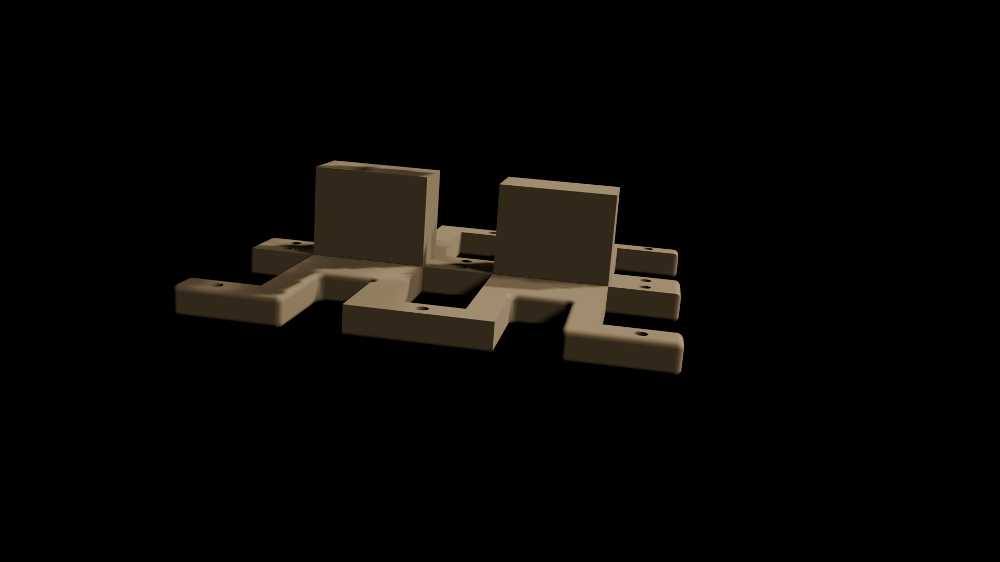
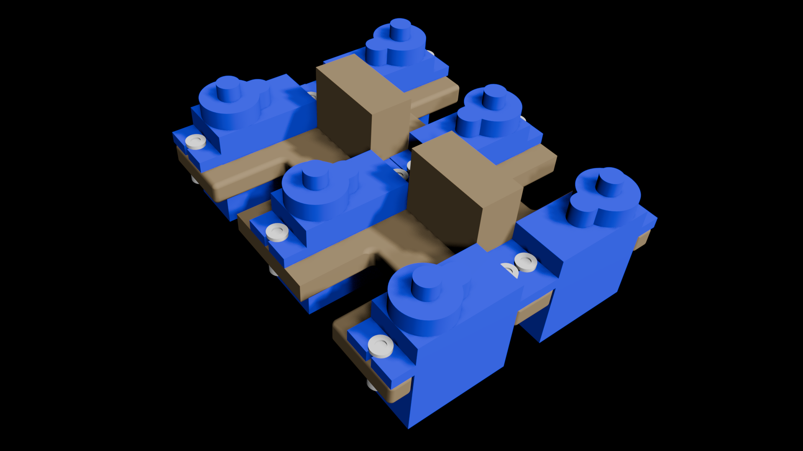
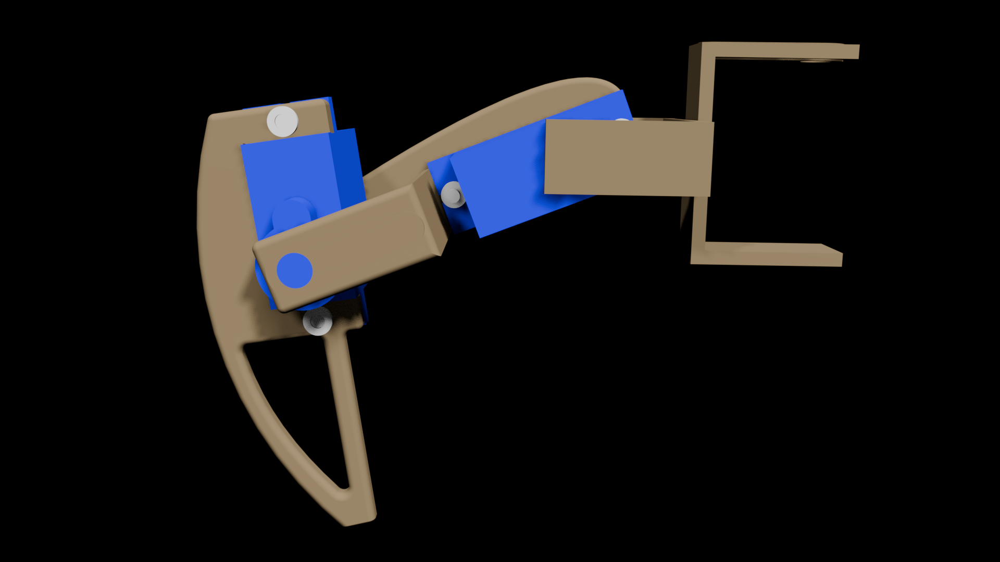
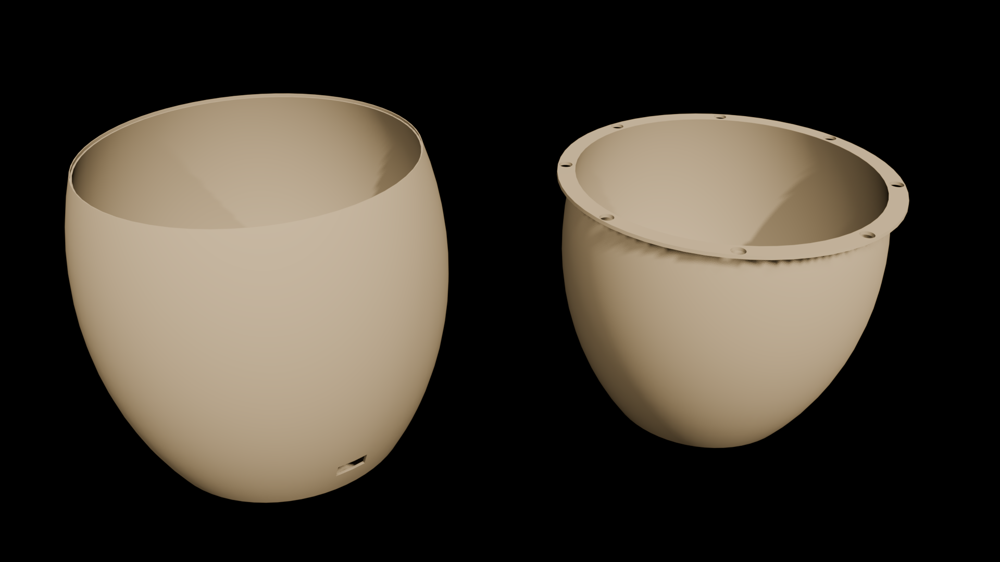
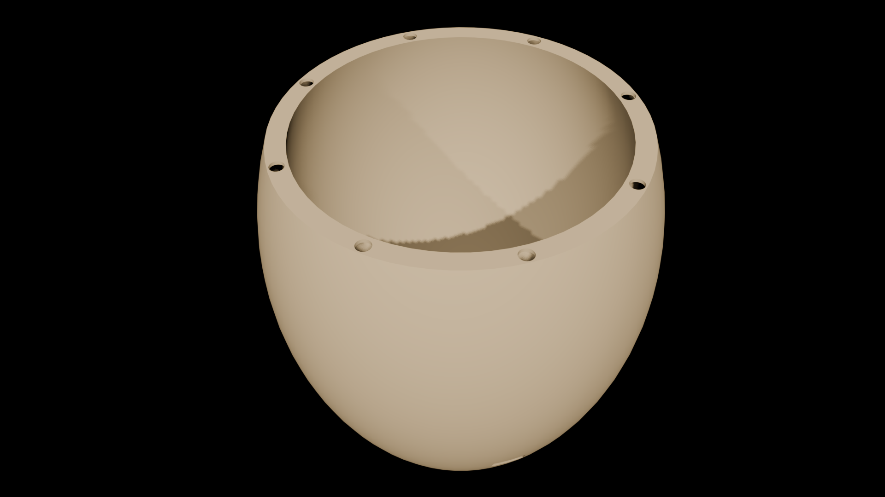
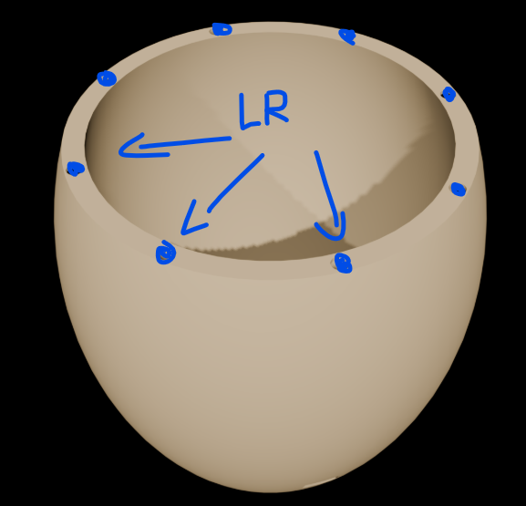
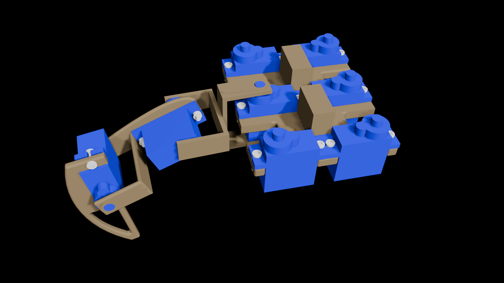
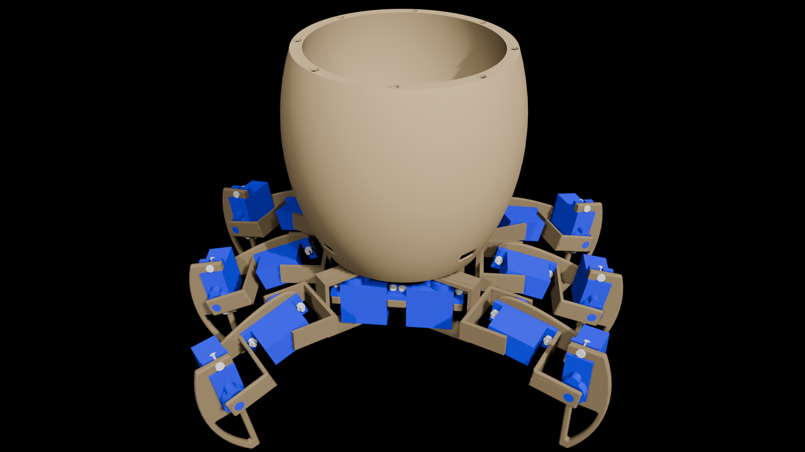

# WaPo Instructions
These are the instructions for building the WaPo.

## Ordering the PCB

First, upload the gerber files

Recommended Settings:

    Layers: 4
    Dimensions: 60mm x 60mm
    PCB Thickness: 1.6mm

## Software
For the start flush the PCB with the [buildDebug.ino](https://github.com/hackTheWorldHappy/Walking-Pot/blob/main/firmware/buildDebug.ino) Script. It sets the Servos in the right postition, so when you put the Servo head on top, it will be right.
After Building WaPo, you can put the [script.ino](https://github.com/hackTheWorldHappy/Walking-Pot/blob/main/firmware/script.ino) on the PCB/Microcontroller and it should walk to the Sun on battery connection.

## Assembling

### Base Plate

Add 6 Servos like this and assembly them with 12 M2 10mm Screw and 12 M2 Nuts 
 
 

### Legs

There are 6 Legs.
Every Leg has 3 parts, that need to be printed and assembled:

Leg Assembly with 2 Servos and 4  M2 8mm Screw and 4 M2 Nuts

 

### Pot

The Pot is two Parts where the PCB fits inbetween

 

Put the PCB through the pins from the outer pot shell, then add the Servo cables and the Light sensor Cables.
The Servo Cables go through the holes of the outer shell.
Solder/Put the Lightresistors to the Cables peaking out of the Holes from the inner Shell.

 

The Lightresistor Placement should look like this:

 

### Put it together

Put the Leg on the Servo and then the servo head on top

 

The put the pins from the outer shell into the holes from the Base Plate (you can glue it if you want).

 

Last, add the battery between the outer shell and the inner shell.  
Add Dirt in the Pot and a beautiful Flower or Plant.  
Now WaPo is finished :)
